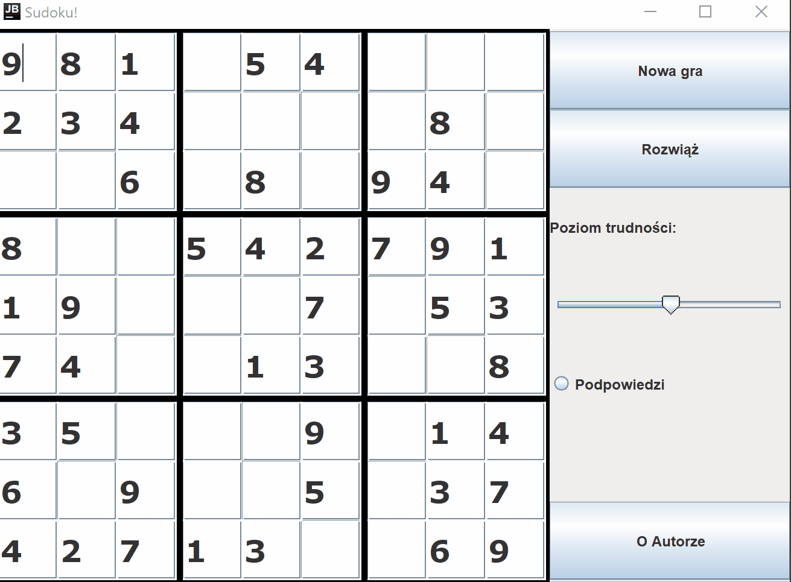

# Sudoku
A classic sudoku game
Project made as an assignment for postgraduate studies on Warsaw University of Technology

Program uses swing for GUI

## Example



## Running

It is a simple Java application and it only requires JDK 11 on your machine.

**1. Clone the application**

```bash
git clone https://github.com/Bartosz-Rogala/Sudoku.git
cd sudoku/src
```

**2. Compile**

```bash
javac -sourcepath ./src -d bin src/Sudoku.java
```

**2. Run**

```bash
java -classpath ./bin Sudoku
```